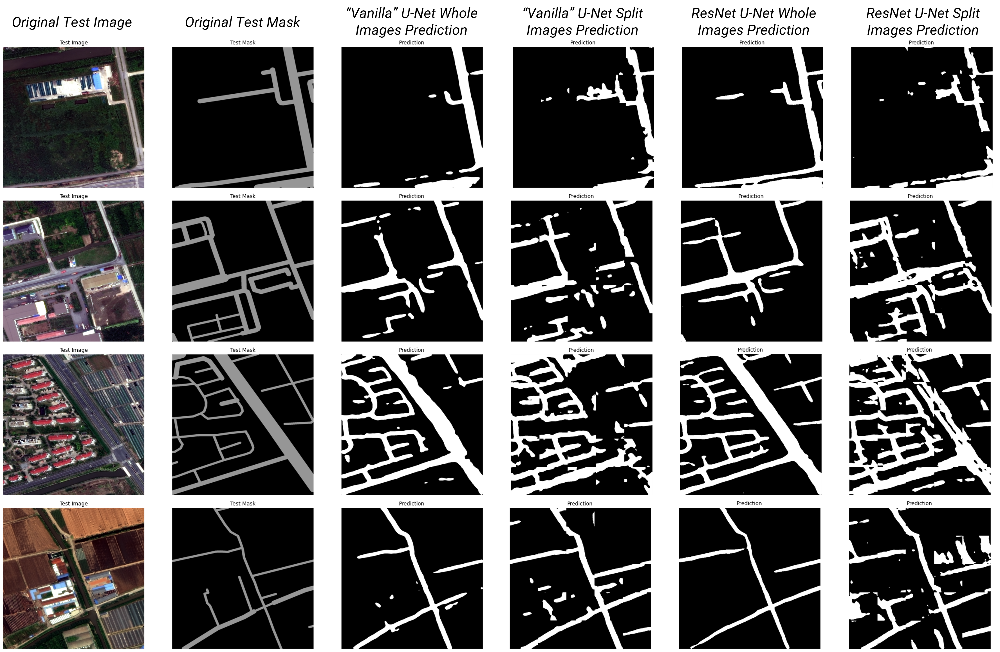

# Retrieving Roads from Remote Sensing Imagery
Capstone Project of CPLN 680, Spring 2022, University of Pennsylvania     
Jiamin Tan     
     
## Overview
Using U-Net architecture, this project segments roads from remote sensing images. The `Tan_RoadDetection_report.pdf` documents the processes, results, and findings.     

## Data
Data used for this project come from the [SpaceNet 3 Challenge](https://spacenet.ai/spacenet-roads-dataset/). Although the original dataset is too large to be uploaded to this GitHub Repo, it can be accessed and downloaded from AWS. Please use the following commands for downloading the training and testing sets: `aws s3 cp s3://spacenet-dataset/spacenet/SN3_roads/tarballs/SN3_roads_train_AOI_4_Shanghai.tar.gz .`, `aws s3 cp s3://spacenet-dataset/spacenet/SN3_roads/tarballs/SN3_roads_test_public_AOI_4_Shanghai.tar.gz .`.

## Files in this Repo
`Tan_RoadDetection_report.pdf` is the final report for this project.
     
          
`notebooks` contains all the Jupyter notebooks used for processing the data and for training and getting predictions of the neural networks. All the models can be found in notebooks in corresponded names.
     
          
`modules` contains all functions used for data processing. The uses of each function are documented on top of each `.py` file.
     
     
`modules/apls_modules` includes three modified scripts provided by SpaceNet for generating binary masks and convert images to 24 bit-depth.
     
     
`slides` contains all presentation slides made throughout the semester.     

